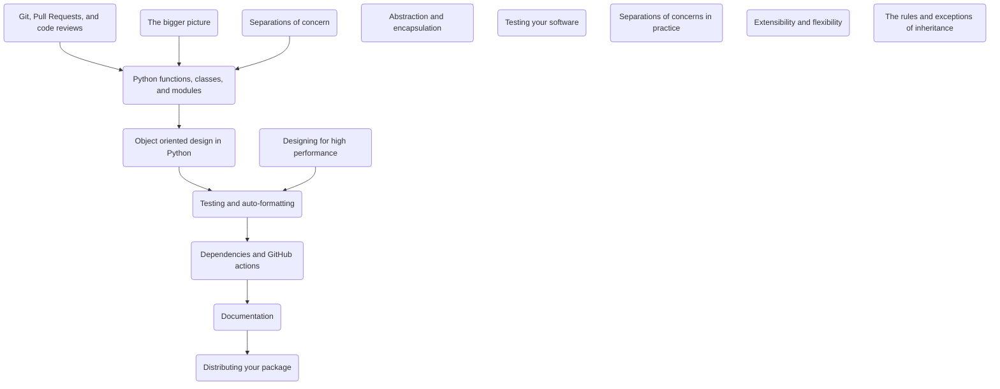

```mermaid

graph TD

    M1(Git, Pull Requests, and code reviews)
    M2(Python functions, classes, and modules)
    M3(Object oriented design in Python)
    M4(Testing and auto-formatting)
    M5(Dependencies and GitHub actions)
    M6(Documentation)
    M7(Distributing your package)

    B1(The bigger picture)
    B2(Separations of concern)
    B3(Abstraction and encapsulation)
    B4(Designing for high performance)
    B5(Testing your software)
    B6(Separations of concerns in practice)
    B7(Extensibility and flexibility)
    B8(The rules and exceptions of inheritance)

    M1 --> M2 --> M3 --> M4 --> M5 --> M6 --> M7

    B1 --> M2
    B2 --> M2
    B4 --> M4
```