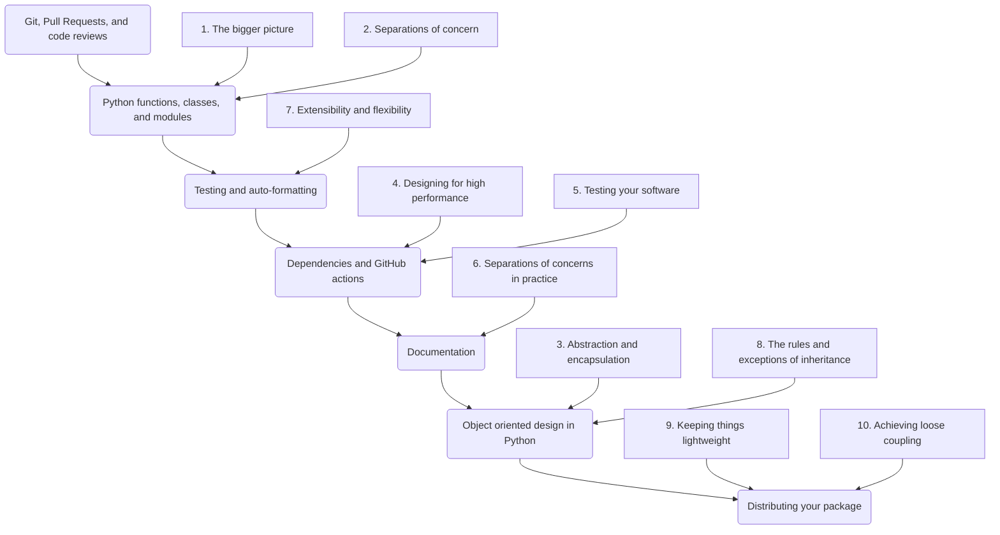

```mermaid

flowchart TD

    M1(Git, Pull Requests, and code reviews)
    M2(Python functions, classes, and modules)
    M3(Testing and auto-formatting)
    M4(Dependencies and GitHub actions)
    M5(Documentation)
    M6(Object oriented design in Python)
    M7(Distributing your package)

    B1[1. The bigger picture]
    B2[2. Separations of concern]
    B3[3. Abstraction and encapsulation]
    B4[4. Designing for high performance]
    B5[5. Testing your software]
    B6[6. Separations of concerns in practice]
    B7[7. Extensibility and flexibility]
    B8[8. The rules and exceptions of inheritance]
    B9[9. Keeping things lightweight]
    B10[10. Achieving loose coupling]

    M1 --> M2 --> M3 --> M4 --> M5 --> M6 --> M7

    B1 --> M2
    B2 --> M2
    B3 --> M6
    B8 --> M6
    B4 --> M4
    B5 --> M4
    B6 --> M5
    B7 --> M3

    B9 --> M7
    B10 --> M7   
    
```
